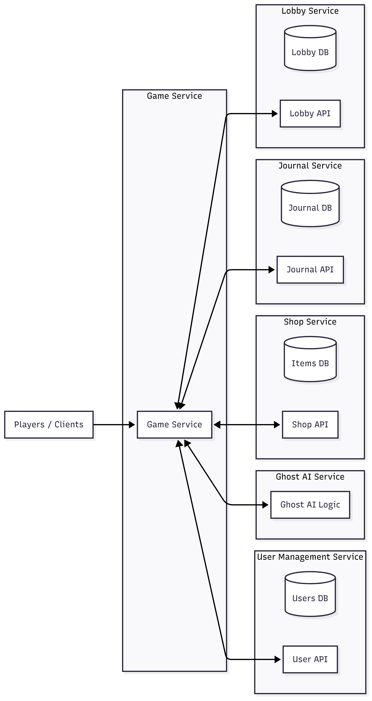

# Ghost Hunters

## Game Microservices – Service Boundaries

This project follows a microservices architecture to ensure modularity, scalability, and independent deployment of each component. Each service is implemented in a different language to promote polyglot programming, reflecting the diversity of team expertise and optimizing for specific business needs.

We use Python and Go, as they are simple to learn, widely supported, and well-suited for game backend scenarios.
Python is chosen for services that need flexibility and fast iteration (user data, AI logic), while Go is selected for performance-critical and real-time state management (shop, lobby).

## Services Overview

## 1. User Management Service

### Responsibilities:

- Manage user accounts and authentication (email, username, password).

- Store and update player metadata (level, in-game currency).

- Implement a friend system (add, remove, list friends).

### Service Boundaries:

- Handles only user-related data and relationships.

- Does not directly interact with game logic or AI.

### Interfaces/Consumers:

### Provides APIs for:

- User authentication & profile data.

- Friend lists (for social and cooperative play).

### Consumed by:

- Lobby Service (fetch user info).

- Inventory Service (currency checks).

---

## 2. Ghost AI Service

### Responsibilities:

- Controls the game’s ghost AI behavior.

- Each ghost runs as a separate Thread/Actor with its own decision-making.

- ### Processes:

   - Map layout.
   - Difficulty settings.
   - Player sanity levels.
   - Movable/interactable objects.
   - Player targeting and attack decisions.

- Sends AI state updates to the Game Service.

### Service Boundaries:

- Does not manage user data.

- Encapsulates all ghost logic independent of the game state store.

### Interfaces/Consumers:

- Provides APIs/events for ghost state changes (hiding, haunting, interacting).

### Consumed by:

- Lobby Service (session updates).

---

## 3. Shop Service

### Responsibilities:

- Provides catalog of purchasable items (title, description, durability, price).

- Maintains price history.

### Service Boundaries:

- Handles item data only.

### Consumers:

- Inventory Service (item ownership).

- Lobby Service (loading items into session).

---

## 4. Lobby Service

### Responsibilities:

- Tracks active game sessions, players in them, their sanity, death status.

- Manages items brought into the session and their holders.

- Tracks ghost type and map for each session.

### Service Boundaries:

- Maintains session state and metadata only.

### Consumers:

- Inventory Service (item ownership).

---

### Architecture diagram

---

# Technologies & Communication Patterns

## General Communication Approach:

- REST APIs for synchronous communication (simple, well-understood).

- gRPC / Message Queue for asynchronous events where real-time updates or decoupling are needed.

- WebSockets for real-time communication with players (e.g., chat, lobby updates).

## 1. User Management Service
### Language & Framework:

- Python

- FastAPI

### Why:

- Beginner-friendly, quick to prototype user flows (auth, friends).

- Good ecosystem for authentication & security (JWT, OAuth).

- Async support in FastAPI makes it efficient for handling many concurrent users.

### Communication:

### Provides REST APIs for:

- User authentication & profile data.

- Friend system (add/remove/list).

### Consumed by:

- Lobby Service (fetch user info).

- Inventory Service (currency checks).

### Trade-offs:

Python is slower than Go, but user management is more I/O-bound than CPU-heavy → acceptable.

## 2. Ghost AI Service
### Language & Framework:

- Python (asyncio, FastAPI for control plane).

### Why:

- Python is strong for prototyping AI behavior, with libraries for state machines and simulations.

- Easy to spawn async tasks or processes for each ghost acting independently.

- Allows fast experimentation with ghost decision-making.

### Communication:

Provides async events / REST APIs:

Ghost state updates (hiding, haunting, object interaction).

### Consumed by:

- Lobby Service (session updates).

- Game Service indirectly for broadcasting ghost behavior.

### Trade-offs:

Python concurrency (asyncio) is not as fast as Go, but ghost behavior logic is relatively lightweight compared to session state handling → trade-off acceptable.

## 3. Shop Service
### Language & Framework:

- Go + Gin 
- gRPC/WebSocket

### Why:

- Shop must handle real-time price updates efficiently.

- Go provides strong concurrency via goroutines, making it perfect for event-driven updates.

- Fast and memory-efficient, ensuring scalability when many players check shop prices.

### Communication:

Provides REST APIs for:

- Item catalog.

- Price history queries.

Provides WebSocket for:

- Real-time price changes.

### Consumed by:

- Inventory Service (item ownership).

- Lobby Service (loading items into session).

### Trade-offs:

Requires more boilerplate compared to Python, but Go’s performance ensures low-latency updates.

## 4. Lobby Service
### Language & Framework:

- Go + Gin

- gRPC

- WebSocket

### Why:

- Lobby requires real-time updates (sanity, death, items, ghost activity).

- Go handles many concurrent connections well, making it the best choice for player session tracking.

- Easy to integrate with Ghost AI via gRPC and push updates via WebSocket.

### Communication:

Provides REST APIs + WebSocket for:

- Session creation, updates, queries.

- Real-time lobby updates (sanity, death, ghost activity).

### Consumes:

- Ghost AI (events via REST or message queue).

- User Management (player profiles).

- Inventory Service (item ownership).

### Trade-offs:

More verbose than Python, but guarantees performance under high player load.