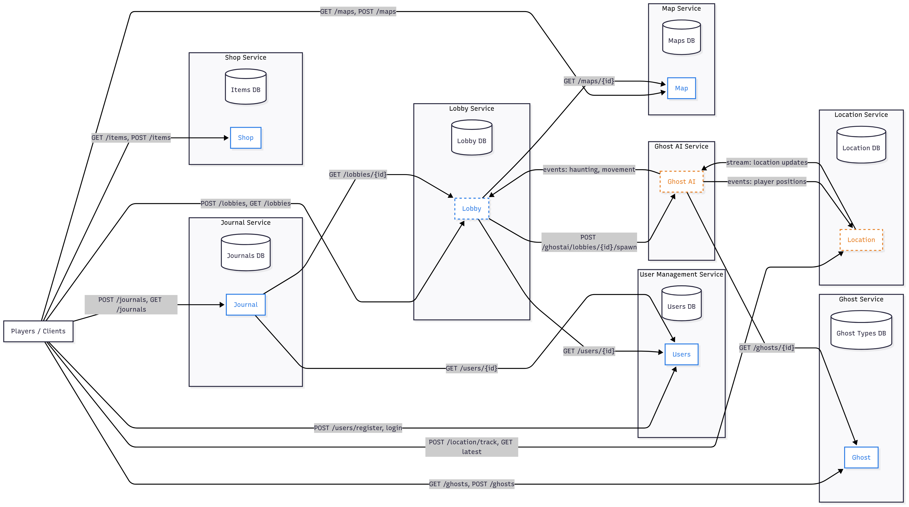

# Ghost Hunters

## Game Microservices – Service Boundaries

This project follows a microservices architecture to ensure modularity, scalability, and independent deployment of each component. Each service is implemented in a different language to promote polyglot programming, reflecting the diversity of team expertise and optimizing for specific business needs.

We use Python and Go, as they are simple to learn, widely supported, and well-suited for game backend scenarios.
Python is chosen for services that need flexibility and fast iteration (user data, AI logic), while Go is selected for performance-critical and real-time state management (shop, lobby).

## Services Overview

## 1. User Management Service

### Responsibilities:
- Manage user accounts and authentication (email, username, password).
- Store and update player metadata (level, in-game currency).
- Implement a friend system (add, remove, list friends).

### Service Boundaries:
- Handles only user-related data and social relationships.
- Does not manage game session logic, AI behavior, or inventory.
- Provides identity and social graph for other services to consume.

### Interfaces / Consumers:

**Provides APIs for:**
- User authentication and profile management.
- Currency balance queries and updates.
- Friend system operations.

**Consumed by:**
- Lobby Service (to fetch player info for sessions).
- Inventory Service (currency validation for purchases).
- Game Service (to load player profile into active sessions).

### Trade-offs:
- **Pros:**  
  - JavaScript (Node.js) is very strong at handling concurrent HTTP requests efficiently due to its non-blocking event loop.  
  - Mature ecosystem (Passport.js, JWT, OAuth libraries) makes it easy to implement authentication and authorization.  
  - Easy integration with frontend teams already using JS/TS.  

- **Cons:**  
  - Single-threaded model means CPU-heavy tasks (e.g., encryption, hashing) can block the event loop unless offloaded to worker threads.  
  - Requires careful handling of async code to avoid callback hell or performance bottlenecks.  
  - Less suited for very compute-heavy logic compared to languages like Go or C#.  

---

## 2. Ghost AI Service

### Responsibilities:
- Controls ghost AI behavior within each game lobby.
- Each ghost runs as an independent Thread/Actor (can be simulated with Node.js worker threads or clustered processes).
- Processes contextual data, such as:
  - Map layout.
  - Difficulty settings.
  - Player sanity levels.
  - Movable/interactable objects.
  - Player targeting and attack decisions.
- Relays ghost state changes to the Game Service.

### Service Boundaries:
- Encapsulates all ghost decision-making logic.
- Does not store user data or session management.
- Operates independently of other services, but shares state updates as needed.

### Interfaces / Consumers:

**Provides APIs/events for:**
- Ghost state changes (hiding, haunting, interacting).
- AI decisions relevant to player interactions.

**Consumed by:**
- Game Service (to update lobby state and broadcast ghost activity to players).
- Lobby Service (to synchronize ghost type and behavior with session state).

### Trade-offs:
- **Pros:**  
  - JavaScript (Node.js) can handle multiple concurrent lobbies with **async I/O** and event-driven architecture.  
  - Can integrate real-time updates easily with **WebSockets (Socket.IO)** for broadcasting ghost actions to players.  
  - Worker threads or Node.js clustering allow distributing ghost AI computations across CPU cores.  

- **Cons:**  
  - Node.js is not optimal for heavy CPU-bound AI simulations — logic may need to be simplified or offloaded to specialized services.  
  - Debugging concurrent ghost actors across threads can become complex.  
  - Event-driven model requires careful design to avoid race conditions or inconsistent state across lobbies.  

--- 

## 3. Shop Service

### Responsibilities:
- Provides a catalog of purchasable items:
  - Title, description, durability (number of sessions usable).
  - Current price and full price history.
- Ensures items and prices are accessible to players during gameplay.
- Allows dynamic price updates with historical tracking.

### Service Boundaries:
- Handles only item-related data and price management.
- Does not manage player ownership (handled by Inventory Service).
- Independent from gameplay logic, only provides catalog information and updates.

### Interfaces / Consumers:

**Provides APIs for:**
- Listing items with descriptions, durability, and prices.
- Retrieving price history for each item.
- Updating prices.

**Consumed by:**
- Inventory Service (to validate item purchases).
- Lobby Service (to load selected items into sessions).
- Game Service (to display purchasable content).

### Trade-offs:
- **Pros:** Implemented in **.NET (C# ASP.NET Core Web API)** for strong type safety, maintainability, and enterprise-grade tooling.  
  ASP.NET Core also provides excellent performance under heavy loads, with built-in dependency injection and middleware pipelines.  
- **Cons:** Development speed may be slower compared to lightweight frameworks due to more verbose configuration and stricter typing.  

---

## 4. Journal Service

### Responsibilities:
- Allows players to record:
  - Symptoms observed during exploration.
  - Type of ghost they believe they encountered.
- Stores journal entries per user and session.
- Validates journal entries at the end of a session by comparing them to the actual ghost type.
- Awards in-game currency for accurate records.

### Service Boundaries:
- Encapsulates only journal-related data and validation.
- Does not manage user authentication, ghost AI, or currency itself (delegates currency update to User Management Service).
- Independent of session management, only consumes final game state to validate entries.

### Interfaces / Consumers:

**Provides APIs for:**
- Creating and updating journal entries.
- Retrieving entries by user or session.
- Validating journal results at game end.

**Consumed by:**
- Lobby Service (to know which player journals to check).
- User Management Service (to reward currency for correct guesses).
- Game Service (to compare journal entries with actual ghost).

### Trade-offs:
- **Pros:** Implemented in **.NET (C# ASP.NET Core Web API)** for structured CRUD operations with Entity Framework Core for database handling.  
  Strong type system makes validation and business logic more robust.  
  Integration with other .NET-based services (e.g., User Management, Lobby) is straightforward.  
- **Cons:** Higher entry barrier for rapid prototyping compared to scripting languages. Requires more boilerplate (DTOs, Models, Migrations).  

---

## 5. Lobby Service

### Responsibilities:
- Manages **active game sessions**, storing:
  - Difficulty level.
  - Players in the session, with:
    - Sanity levels.
    - Death status.
  - Items brought into the session and their current holders.
  - Ghost type for the session.
  - Map currently used in the lobby.
- Ensures items are expired along with dead players (removal from session inventory).

### Service Boundaries:
- Encapsulates only **session-related state and metadata**.
- Does not manage:
  - User authentication (delegated to User Management Service).
  - Ghost behavior (delegated to Ghost AI Service).
  - Item catalog (delegated to Shop Service).
- Acts as the **single source of truth** for an ongoing or paused session.

### Interfaces / Consumers:

**Provides APIs for:**
- Creating, updating, and resuming game sessions.
- Managing session players (join, leave, update status).
- Tracking sanity, deaths, and item ownership.
- Associating map and ghost type with a session.

**Consumed by:**
- Game Service (to run the actual gameplay loop).
- User Management Service (to sync player profiles and stats).
- Shop Service & Inventory Service (to validate items used in the lobby).
- Ghost AI Service (to get lobby info for ghost behavior).

### Trade-offs:
- **Pros:** Implemented in **Python (FastAPI/Flask)** for fast development, clear API design, and large ecosystem of libraries. Python’s async support (in FastAPI) allows concurrent session handling efficiently.  
- **Cons:** Slower raw performance compared to Go or Node.js, so scaling for millions of concurrent users may require horizontal scaling (more containers/instances).  

---

## 6. Map Service

### Responsibilities:
- Provides tools for users to **create and manage maps**, including:
  - Houses with rooms connected to each other.
  - Placement of objects inside rooms.
  - Definition of hiding places (inaccessible to ghosts).
- Stores predefined maps and allows dynamic map creation (custom maps).
- Provides APIs for retrieving map layouts for gameplay.

### Service Boundaries:
- Focuses only on **map structure and object placement**.
- Does not:
  - Handle ghost AI (only provides hiding spots).
  - Manage players or items in the map (handled by Lobby & Inventory).
  - Track session state (delegated to Lobby Service).
- Acts as a **map provider** to other services.

### Interfaces / Consumers:

**Provides APIs for:**
- Creating new houses (with rooms and objects).
- Modifying or shuffling object placement.
- Querying hiding spots and room connectivity.
- Retrieving stored maps.

**Consumed by:**
- Lobby Service (to assign a map to a session).
- Ghost AI Service (to know where hiding spots and objects are).
- Game Service (to render maps for players).

### Trade-offs:
- **Pros:** Implemented in **Python (FastAPI/Flask)**, which naturally works well with JSON-based structures for maps. Flexible data modeling (e.g., Pydantic in FastAPI) ensures safe map creation and validation.  
- **Cons:** Handling very large maps or heavy computations (like pathfinding) in pure Python could be slow — may need C-extensions or caching strategies.  

### Architecture diagram

---

# Technologies & Communication Patterns

## General Communication Approach:

- REST APIs for synchronous communication (simple, well-understood).

- gRPC / Message Queue for asynchronous events where real-time updates or decoupling are needed.

- WebSockets for real-time communication with players (e.g., chat, lobby updates).

## 1. User Management Service
### Language & Framework:

- Python

- FastAPI

### Why:

- Beginner-friendly, quick to prototype user flows (auth, friends).

- Good ecosystem for authentication & security (JWT, OAuth).

- Async support in FastAPI makes it efficient for handling many concurrent users.

### Communication:

### Provides REST APIs for:

- User authentication & profile data.

- Friend system (add/remove/list).

### Consumed by:

- Lobby Service (fetch user info).

- Inventory Service (currency checks).

### Trade-offs:

Python is slower than Go, but user management is more I/O-bound than CPU-heavy → acceptable.

## 2. Ghost AI Service
### Language & Framework:

- Python (asyncio, FastAPI for control plane).

### Why:

- Python is strong for prototyping AI behavior, with libraries for state machines and simulations.

- Easy to spawn async tasks or processes for each ghost acting independently.

- Allows fast experimentation with ghost decision-making.

### Communication:

Provides async events / REST APIs:

Ghost state updates (hiding, haunting, object interaction).

### Consumed by:

- Lobby Service (session updates).

- Game Service indirectly for broadcasting ghost behavior.

### Trade-offs:

Python concurrency (asyncio) is not as fast as Go, but ghost behavior logic is relatively lightweight compared to session state handling → trade-off acceptable.

## 3. Shop Service
### Language & Framework:

- Go + Gin 
- gRPC/WebSocket

### Why:

- Shop must handle real-time price updates efficiently.

- Go provides strong concurrency via goroutines, making it perfect for event-driven updates.

- Fast and memory-efficient, ensuring scalability when many players check shop prices.

### Communication:

Provides REST APIs for:

- Item catalog.

- Price history queries.

Provides WebSocket for:

- Real-time price changes.

### Consumed by:

- Inventory Service (item ownership).

- Lobby Service (loading items into session).

### Trade-offs:

Requires more boilerplate compared to Python, but Go’s performance ensures low-latency updates.

## 4. Lobby Service
### Language & Framework:

- Go + Gin

- gRPC

- WebSocket

### Why:

- Lobby requires real-time updates (sanity, death, items, ghost activity).

- Go handles many concurrent connections well, making it the best choice for player session tracking.

- Easy to integrate with Ghost AI via gRPC and push updates via WebSocket.

### Communication:

Provides REST APIs + WebSocket for:

- Session creation, updates, queries.

- Real-time lobby updates (sanity, death, ghost activity).

### Consumes:

- Ghost AI (events via REST or message queue).

- User Management (player profiles).

- Inventory Service (item ownership).

### Trade-offs:

More verbose than Python, but guarantees performance under high player load.